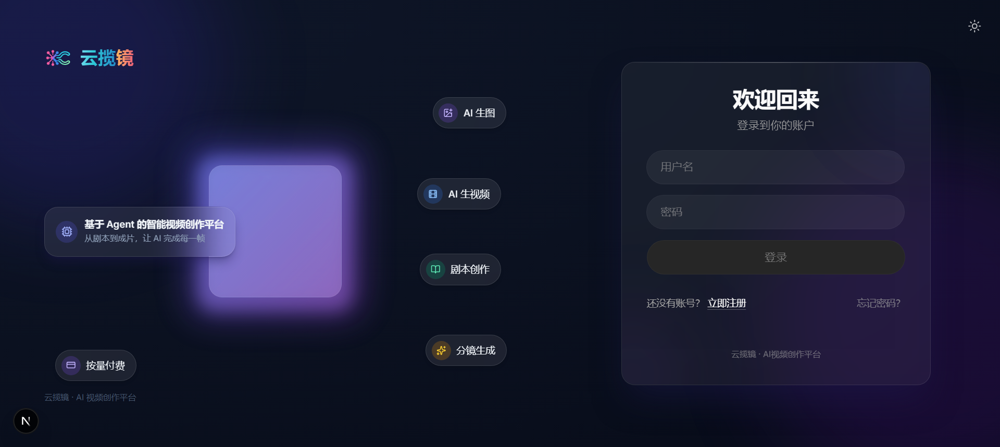
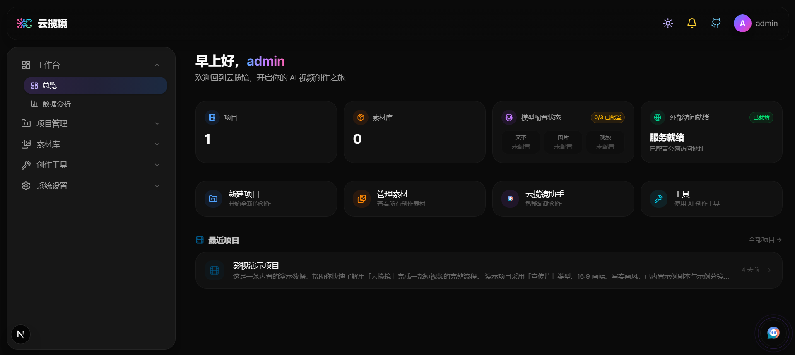
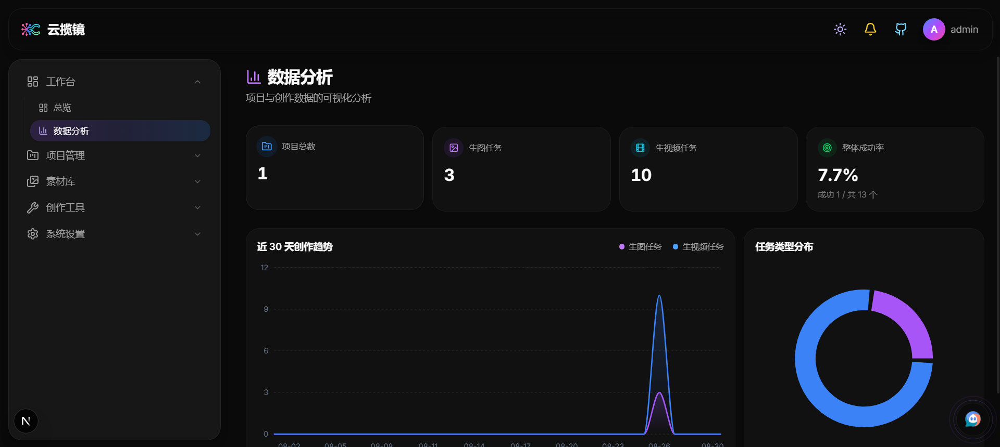
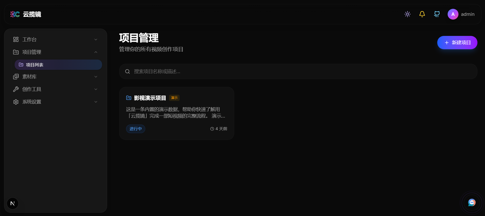
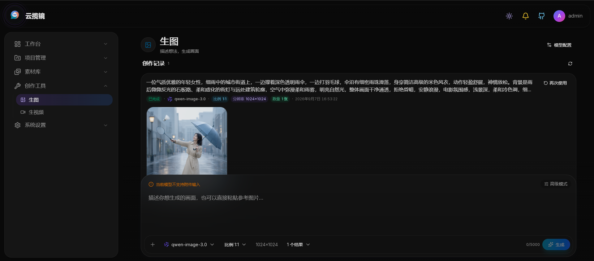
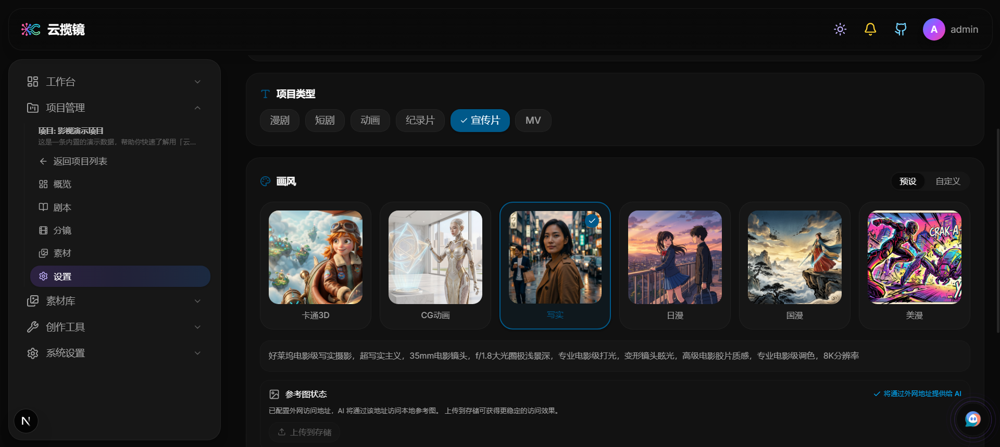
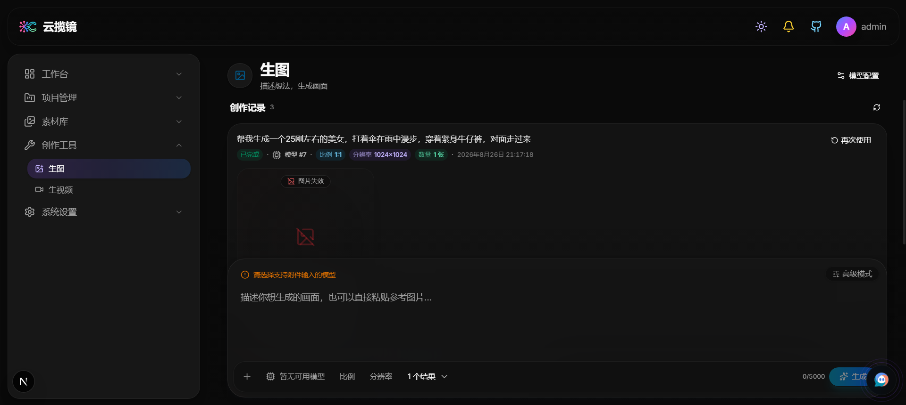
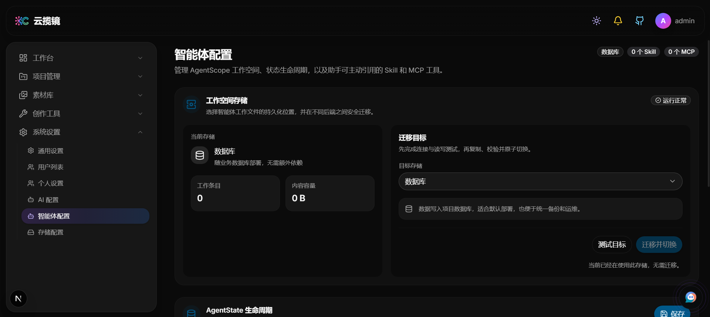

<p align="center">
  
</p>

<p align="center">
  <strong>简体中文</strong> | <a href="README_EN.md">English</a>
</p>

<h1 align="center">云揽镜</h1>

<p align="center">Agent 驱动的视频创作平台</p>

<p align="center">
  <a href="https://github.com/yunlance/aifusionvideo/releases"></a>
  <a href="LICENSE"></a>
  
  
</p>

<p align="center">
  <a href="https://md.xinchyun.com/"></a>
</p>

<p align="center">
  <sub>无需部署，打开浏览器即可体验完整功能 → <a href="https://md.xinchyun.com/"><strong>md.xinchyun.com</strong></a></sub>
</p>

<hr/>

云揽镜是一款面向视频创作者的 Agent 驱动创作平台，将项目、剧本、分镜、素材以及图片与视频生成整合在统一工作区。创作者可以按分集和场景组织剧本、拆解与调整分镜，并围绕每个镜头完成素材生成和管理。

本仓库包含 Java 后端、Next.js 前端和 Docker Compose 部署配置。部署完成后访问页面，使用 `admin` 登录即可开始使用。云端模型默认走云揽川聚合网关，本地 ComfyUI 作为可选生成通道。

## 功能

| 模块 | 当前能力 |
| --- | --- |
| 项目与团队 | 管理创作项目、项目成员和协作角色 |
| 剧本创作 | 按分集和场景组织剧本，并将项目上下文交给 Agent |
| 分镜制作 | 从剧本整理分镜，编辑镜头内容、参考素材和生成结果 |
| 图片与视频 | 根据文本或参考素材生成图片与视频，并持续跟踪后台任务进度 |
| 素材管理 | 统一管理项目素材和可复用的图片、视频资源 |
| Agent 工作区 | 支持流式对话、多模态上下文、工具权限、Skill、MCP 与子 Agent |
| 模型与存储 | 在设置页填写云揽川 Key，或接入本地 ComfyUI 工作流；媒体可选本地磁盘或对象存储 |
| 系统管理 | 提供用户与角色管理、密码重置和版本检查 |

### Agent 与工具

内置 Agent 工作区可以结合项目内容持续对话，接收图片、视频、音频和文件等多模态输入，并在界面中展示推理过程、工具调用和任务状态。

Agent 运行基于 AgentScope，支持 Skill、MCP 和子 Agent。会话与运行状态会持久化保存，模型能力和工具权限可按会话配置，适合处理需要多步骤协作的创作任务。

### 模型与生成协议

模型和 API Key 在设置页填写，不会写入源码。云端对话、图片和视频默认走内置的 **云揽川** 聚合网关；本地 **ComfyUI** 工作流可作为第二条生成通道单独配置。页面不再开放自行添加 OpenAI、Anthropic、Gemini 等第三方云端渠道。

启动后请在「设置 > AI 模型」填写云揽川 API Key。具体可用模型取决于网关账号和权限。

### 存储

媒体素材可以保存在本地磁盘或 S3 兼容对象存储中。Agent 工作区同样支持数据库、本地磁盘和对象存储，可根据本地开发、单机部署或云端部署的需要灵活选择。

## 界面演示

















## 技术栈

| 层级 | 技术 |
| --- | --- |
| 前端 | Next.js 16、React 19、TypeScript、Tailwind CSS 4、Base UI / Shadcn、Zustand |
| 后端 | Java 21、Spring Boot 3.5、Spring Security、Spring AI、AgentScope、MyBatis-Plus |
| 数据 | MySQL 8、Redis、Flyway |
| 媒体 | FFmpeg、FFprobe、本地存储或 S3 兼容对象存储 |
| 部署 | Docker Compose、Nginx |

## 快速部署

### Docker Compose

推荐使用 Docker Compose 部署。安装 Docker Engine 和 Docker Compose 后，执行：

```bash
git clone https://github.com/yunlance/aifusionvideo.git
cd aifusionvideo

cp .env.example .env

docker compose up -d
```

执行后会拉取预构建镜像并启动 MySQL、Redis、后端、前端和 Nginx。

如需自定义端口、密码或部署方式，请以 `.env.example` 为模板编辑根目录 `.env`。该文件已被 Git 忽略，更新项目时无需修改 `docker-compose.yml`。建议部署前在 `.env` 中设置 `ADMIN_PASSWORD`。

启动完成后访问 <http://localhost:5858>，使用 `admin` 和 `.env` 中的 `ADMIN_PASSWORD` 登录。查看服务状态或跟踪后端日志，可以运行：

```bash
docker compose ps
docker compose logs -f backend
```

Nginx 作为统一访问入口，并将 `/api/**` 和 `/media/**` 请求转发到后端。若要部署到公网，请先在 `.env` 中修改默认数据库密码、Redis 密码和 `ADMIN_PASSWORD`。

### 本地构建镜像

如需从当前源码构建前后端镜像，执行：

```bash
docker compose -f docker-compose.build.yml up -d --build
```

### 前后端独立部署

如果前端与后端分别使用不同的公网域名，请在 `.env` 中配置：

```env
PUBLIC_API_URL=https://api.example.com
CORS_ALLOWED_ORIGIN_PATTERNS=https://app.example.com
FRONTEND_PORT=5000
BACKEND_PORT=15858
```

`PUBLIC_API_URL` 应填写后端根地址，末尾不要添加 `/api`。后端默认全局允许跨域；生产环境建议像示例一样将 `CORS_ALLOWED_ORIGIN_PATTERNS` 限制为实际前端来源，多个来源使用英文逗号分隔。

使用预构建镜像：

```bash
docker compose -f docker-compose.yml -f docker-compose.separated.yml up -d
```

从源码构建镜像：

```bash
docker compose -f docker-compose.build.yml -f docker-compose.separated.yml up -d --build
```

前后端独立部署不会启动仓库内置的 Nginx。请分别为前端和后端配置 HTTPS 反向代理，并在“系统设置 > 通用”中确认站点公网地址和后端资源公网地址。

## 源码开发

### 环境要求

- JDK 21
- Node.js 20 和 pnpm 10
- Docker，用于启动本地 MySQL 与 Redis
- FFmpeg 和 FFprobe，用于视频合成与媒体探测

### 启动依赖和后端

```bash
cd yunlan-video-server
docker compose -f docker-compose-middleware.yml up -d
./mvnw spring-boot:run
```

Windows 环境可以运行 `.\mvnw.cmd spring-boot:run`。

后端默认使用 `local` 配置，相关设置位于 `yunlan-video-server/src/main/resources/application-local.yaml`。如果 FFmpeg 和 FFprobe 不在默认路径，请通过 `VIDEO_COMPOSE_FFMPEG_PATH` 和 `VIDEO_COMPOSE_FFPROBE_PATH` 指定实际位置。

### 不使用 Docker 安装依赖（可选）

如果本机不便使用 Docker，也可以直接安装并运行 MySQL 和 Redis：

1. 安装并启动 **MySQL 8**，创建数据库 `aifusionvideo`（沿用默认账号可用 `root`）。
2. 安装并启动 **Redis**。Windows 无官方原生版，可用 [Memurai](https://www.memurai.com/) 或 WSL；Linux/macOS 用包管理器安装即可。
3. 编辑 `yunlan-video-server/src/main/resources/application-local.yaml`：
   - `spring.datasource.url` / `username` / `password`：改成本机 MySQL 地址。本机直装默认端口是 `3306`（不是 `53306`）。
   - `spring.data.redis.host` / `port` / `password`：改成本机 Redis 地址。本机直装默认端口是 `6379`（不是 `56379`）。
   - `video.compose.ffmpeg-path` / `ffprobe-path`：改成本机 FFmpeg/FFprobe 的实际路径，或通过环境变量 `VIDEO_COMPOSE_FFMPEG_PATH` / `VIDEO_COMPOSE_FFPROBE_PATH` 覆盖。
4. 配置完成后，按上文命令启动后端（`./mvnw spring-boot:run`）与前端（`pnpm dev`）。

> 默认配置中的 `53306` / `56379` 端口和 `D:\ffmpeg-...` 路径是配合 Docker 中间件与本机示例环境使用的，改用本机安装时请按实际环境修改。

### 启动前端

另开一个终端，在仓库根目录执行：

```bash
cd yunlan-video-webui
pnpm install
pnpm dev
```

前端开发服务器会读取 `yunlan-video-webui/.env.development`，并将 `/api/**` 和 `/media/**` 代理到 `http://localhost:15858`。如果后端监听其他端口，可以在 `.env.local` 中覆盖代理地址：

```env
DEV_BACKEND_URL=http://localhost:15858
```

### 本地地址

| 服务 | 地址 |
| --- | --- |
| 前端 | <http://localhost:5000> |
| 后端 | <http://localhost:15858> |
| Swagger UI | <http://localhost:15858/swagger-ui.html> |
| MySQL | `localhost:53306` |
| Redis | `localhost:56379` |

## 配置说明

### Docker 环境变量

Docker Compose 会自动读取仓库根目录的 `.env`。不同启动方式使用的配置如下：

| 部署方式 | Compose 文件 | 需要关注的变量 |
| --- | --- | --- |
| 默认统一入口 | `docker-compose.yml` | 必须关注 MySQL root 密码、Redis 密码和 `ADMIN_PASSWORD`；应用账号可选；可按需修改 `MYSQL_DATABASE`、`APP_PORT`、`JAVA_OPTS` 和 CORS 白名单；`PUBLIC_API_URL` 保持为空 |
| 前后端独立部署 | 基础 Compose 文件 + `docker-compose.separated.yml` | 必须填写 `PUBLIC_API_URL`；生产环境建议填写 `CORS_ALLOWED_ORIGIN_PATTERNS`；可按需修改 `FRONTEND_PORT`、`BACKEND_PORT`；`APP_PORT` 不生效 |

公网部署前必须修改 MySQL root 密码、Redis 密码和 `ADMIN_PASSWORD`；如启用 MySQL 应用账号，也必须设置独立密码。`FRONTEND_PORT`、`BACKEND_PORT` 和 `PUBLIC_API_URL` 仅在组合使用 `docker-compose.separated.yml` 时生效；`CORS_ALLOWED_ORIGIN_PATTERNS` 对所有部署方式生效。

| 变量 | 默认值 | 用途 |
| --- | --- | --- |
| `MYSQL_ROOT_PASSWORD` | `123456` | MySQL `root` 管理密码，公网部署前必须修改 |
| `REDIS_PASSWORD` | `123456` | Redis 访问密码，公网部署前必须修改 |
| `MYSQL_DATABASE` | `aifusionvideo` | MySQL 数据库名，通常无需修改 |
| `APP_PORT` | `5858` | 默认统一入口端口，启动后访问 `http://localhost:5858` |
| `FRONTEND_PORT` | `5000` | 前后端独立部署时暴露的前端端口 |
| `BACKEND_PORT` | `15858` | 前后端独立部署时暴露的后端端口 |
| `PUBLIC_API_URL` | 空 | 前后端独立部署时的后端公网根地址，不包含 `/api` |
| `CORS_ALLOWED_ORIGIN_PATTERNS` | `*` | 允许访问后端的浏览器来源；`*` 表示全部，生产环境建议配置明确来源，多个来源用英文逗号分隔 |
| `JAVA_OPTS` | `-Xms512m -Xmx1024m` | 后端 JVM 参数，通常无需修改 |
| `MYSQL_USERNAME` | 空 | 可选的 MySQL 应用账号，不能设置为 `root`；留空时沿用 root 账号 |
| `MYSQL_PASSWORD` | 空 | 可选的 MySQL 应用账号密码，必须与 `MYSQL_USERNAME` 同时配置 |
| `ADMIN_PASSWORD` | 空 | 启动时创建 `admin` 账号的密码；公开部署前必须设置，留空则使用内置默认哈希 |

使用统一入口部署时，`PUBLIC_API_URL` 必须保持为空；`CORS_ALLOWED_ORIGIN_PATTERNS` 可保留 `*`，也可限制为站点的实际来源。

`MYSQL_USERNAME` 和 `MYSQL_PASSWORD` 必须同时配置或同时留空。直接复制 `.env.example` 时，这两个变量为空，后端仍使用 `root` 和 `MYSQL_ROOT_PASSWORD`，与历史版本默认行为一致。对于全新数据库，如在启动前填写这两个变量，MySQL 会自动创建普通账号并授予 `MYSQL_DATABASE` 的访问权限。已有数据库如需改用普通账号，请先在 MySQL 中创建用户并授权，再填写这两个变量；修改 `.env` 不会自动变更已有数据库账号。

MySQL 端口默认绑定到宿主机 `127.0.0.1:53306`，可直接用本机工具（如 Navicat）访问；Redis 默认不发布端口，如需访问请在 Compose 文件中取消对应 `ports` 注释（示例 `127.0.0.1:46379`）。

### 公网资源地址

云端图片或视频模型通常无法读取 `localhost` 或局域网中的参考素材。请使用公网对象存储，或将后端资源端点安全地暴露到公网，然后在“系统设置 > 通用”中保存对应的公网地址。

站点公网地址用于密码重置邮件和页面链接，后端资源公网地址用于媒体链接和 Agent 引用；两者可以配置为不同域名。

## 项目结构

```text
.
├─ yunlan-video-server/       Java 后端、Flyway 迁移与后端测试
├─ yunlan-video-webui/   Next.js 前端
├─ docker/                Nginx 配置
├─ docker-compose.yml           拉取预构建镜像部署
├─ docker-compose.build.yml     从源码本地构建部署
└─ docker-compose.separated.yml 前后端分域部署覆盖文件
```

## 检查与测试

后端：

```bash
cd yunlan-video-server
./mvnw test
./mvnw -Dtest=FlywayMigrationNamingTests test
./mvnw -Pagentscope-integration verify
```

前端：

```bash
cd yunlan-video-webui
pnpm lint
pnpm build
```

Flyway 迁移脚本位于 `yunlan-video-server/src/main/resources/db/migration/`。版本格式、基线和历史迁移约束见 [Flyway 迁移说明](yunlan-video-server/src/main/resources/db/migration/README.md)。

## 参与贡献

欢迎提交问题反馈、功能建议和代码改进。对于影响范围较大的功能或架构调整，建议先创建 Issue 说明方案，确认方向后再开始开发。

### 开发流程

1. Fork 本仓库并克隆到本地，然后将本仓库添加为 `upstream`：

   ```bash
   git clone https://github.com/YOUR-USERNAME/aifusionvideo.git
   cd aifusionvideo
   git remote add upstream https://github.com/yunlance/aifusionvideo.git
   ```

2. 从最新的 `main` 创建功能分支，请勿直接在 `main` 或版本开发分支上修改：

   ```bash
   git fetch upstream
   git checkout main
   git pull --ff-only upstream main
   git checkout -b feat/your-change
   ```

   分支名称建议使用 `feat/`、`fix/` 或 `docs/` 前缀，并简要说明改动内容。

3. 完成开发后，根据改动范围运行检查：

   ```bash
   # 后端
   cd yunlan-video-server
   ./mvnw test

   # 前端
   cd ../yunlan-video-webui
   pnpm lint
   pnpm build
   ```

4. 提交并推送个人分支：

   ```bash
   git add path/to/changed-file
   git commit -m "feat: describe your change"
   git push -u origin feat/your-change
   ```

5. 创建 Pull Request 时，将目标分支设置为本仓库的 `main` 分支。

提交前请确保改动范围清晰，不包含密钥、账号或本地环境文件；涉及行为变更时，请同步补充测试和必要文档。

## License

[MIT License](LICENSE)

<p align="center">
  <sub>Built by <a href="https://github.com/yunlance">yunlance</a></sub>
</p>
